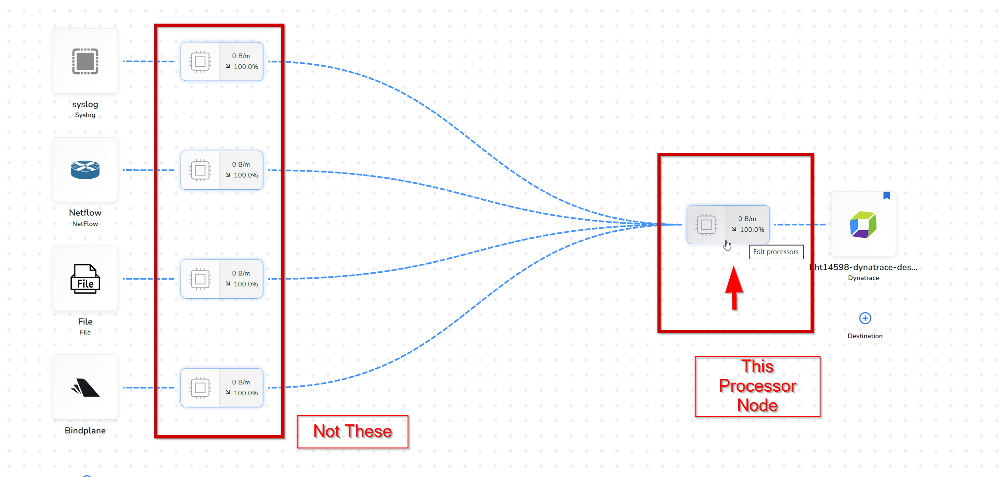

# Quick Reference

Every value you type, paste or search for in this lab, in the order you need it. Each step shows its settings in a table for a quick scan, and anything long or copy-worthy is also a fenced code block below it so you can grab it with the copy button. Each step links to its full walkthrough. All videos and screenshots are collected under [Walkthroughs](#walkthroughs) at the bottom.

## Before you start

Your Dynatrace platform token needs these four scopes:

```
storage:logs:write
openpipeline:logs:ingest
storage:metrics:write
openpipeline:metrics:ingest
```

Both log generators start automatically in the container. You do **not** need to start them.

| Command | Purpose |
|---|---|
| `startBindplane` / `stopBindplane` | The collector process |
| `startLogGenerator` / `stopLogGenerator` | Linux host logs written to `/var/log` |
| `startNetworkTelemetry` / `stopNetworkTelemetry` | Syslog on udp/5140, NetFlow on udp/2055 |

---

## 1. Install the agent &mdash; [details](3-bindplane-agent.md)

*Why:* the agent runs on your dev container and ships logs to Dynatrace. Bindplane manages its config remotely, so you only ever touch the host for this one install step.

Copy the install command from Bindplane, paste it into the container terminal, then start the collector:

```
startBindplane
```

Do **not** use `systemctl`, whatever the installer prints.

Getting the download command:

<video controls muted playsinline preload="metadata" style="width:100%; max-width:100%; height:auto;">
  <source src="../img/3-bindplane-agent/get_agent_installation_command.mp4" type="video/mp4">
  Your browser does not support embedded video.
  <a href="../img/3-bindplane-agent/get_agent_installation_command.mp4">Download the video</a> instead.
</video>

[hs-video](https://dt-arr.github.io/enablement-bindplane-logs/img/3-bindplane-agent/get_agent_installation_command.mp4|Get the agent installation command|Navigating Bindplane to generate the Linux agent install command.)

Installing on the Terminal:

You should see some text scroll by, and a message indicating that the Bindplane collector was installed.

<video controls muted playsinline preload="metadata" style="width:100%; max-width:100%; height:auto;">
  <source src="../img/3-bindplane-agent/terminal-installation.mp4" type="video/mp4">
  Your browser does not support embedded video.
  <a href="../img/3-bindplane-agent/terminal-installation.mp4">Download the video</a> instead.
</video>

[hs-video](https://dt-arr.github.io/enablement-bindplane-logs/img/3-bindplane-agent/terminal-installation.mp4|Install the Bindplane collector|Running the install command in the dev container terminal.)

---

## 2. Create the configuration &mdash; [details](4-bindplane-configuration.md)

*Why:* a Bindplane configuration says where logs come from and where they go. One **Rollout** pushes it to every assigned agent, and it can be versioned and rolled back if needed.

Platform **Linux**. Four sources, one destination. **Start Rollout** when done.

### File source

| Setting | Value |
|---|---|
| Short Description | `file` |
| File Paths | three entries, see below |
| Log Type | `file` |
| Multiline Parsing | `none` |

File Paths &mdash; add each one as its own entry:

```
/var/log/syslog
```

```
/var/log/audit/audit.log
```

```
/var/log/fail2ban.log
```

### Syslog source

Enter the Short Description and accept every other default.

| Setting | Value |
|---|---|
| Short Description | `syslog` |
| Everything else | accept Bindplane defaults |

```
syslog
```

!!! tip "What our simulator sends to udp/5140"
    `push_telemetry.py` emits a realistic mixed enterprise syslog stream: PAN-OS firewall records (the largest share, used in the Parse CSV and Volume Reduction labs), Azure NSG flow logs, Citrix CDF, FSLogix, AVD checkpoints, connections, errors and routine healthchecks. All BSD-format (RFC 3164), landing on `127.0.0.1:5140` where the Bindplane Syslog source picks them up.

!!! warning "If the defaults have drifted"
    This step assumes current Bindplane defaults of **Protocol** = `rfc3164` and **Parse To** = `body`. Those are what the simulator and the later Parse CSV step both depend on; if your UI shows anything else for either, switch them before saving.

### NetFlow source

Enter the Short Description and accept every other default.

| Setting | Value |
|---|---|
| Short Description | `Netflow` |
| Everything else | accept Bindplane defaults |

```
Netflow
```

!!! tip "What our simulator sends to udp/2055"
    The same `push_telemetry.py` emits NetFlow v5 flow records at about 5 flows/sec, batched 20 per datagram. NetFlow v5 needs no template exchange, so records decode immediately on arrival.

### Bindplane Collector source

Don't change any values. Just accept the defaults.

### Dynatrace destination

Your environment ID, plus the token from [Before you start](#before-you-start).

---

### Watch: adding all four sources

<video controls muted playsinline preload="metadata" style="width:100%; max-width:100%; height:auto;">
  <source src="../img/4-bindplane-configuration/add-sources-video.mp4" type="video/mp4">
  Your browser does not support embedded video.
  <a href="../img/4-bindplane-configuration/add-sources-video.mp4">Download the video</a> instead.
</video>

[hs-video](https://dt-arr.github.io/enablement-bindplane-logs/img/4-bindplane-configuration/add-sources-video.mp4|Add all four sources|Adding the File, Syslog, NetFlow and Bindplane Collector sources to the configuration.)

The same four sources are broken down step by step below.


## 3. Add a field &mdash; [details](5-add-field.md)

*Why:* everyone running this lab might push into the same Dynatrace tenant. Stamping a `project` field on every record is how you tell your logs apart from the next person&rsquo;s &mdash; and it is the key OpenPipeline uses in step 6 to route only your traffic through your pipeline.

Click the processor node closest to the **Dynatrace** destination (the shared one that every source feeds into), then **Add Processor** &rarr; search for `add fields` &rarr; pick the **Add Fields** *Transform* result.

**Telemetry type** &mdash; leave only **Logs** selected (metrics and traces don&rsquo;t apply here).

### Fields

| Setting | Value |
|---|---|
| Field Type | **Attribute** |
| Action | **Upsert** |
| Field | `project` |
| Value | `<yourname>` (we use `TonyStark` as the running example) |

Values to copy:

```
project
```

```
<yourname>
```
!!! tip "Changes aren't live until you roll them out"
    Edits to a configuration are saved but not sent to your collectors. To apply them, click **Start Rollout**. Until you do, your collectors keep running the previous configuration.


Click **+ Add field** to stamp more key/value pairs on every record if you want (e.g., `environment`, `owner`); otherwise one row is enough.

Remember this value: step 6 (`matchesValue(project, "<yourname>")`) must use exactly the same string, or your logs will not reach the OpenPipeline pipeline.

!!! info "Body, Attributes, Resource &mdash; which Field Type to choose"
    The **Field Type** dropdown mirrors the three places an OpenTelemetry record can carry data. Picking the right one matters because later processors (and DQL queries) look in specific places.

    | Field Type | OTel meaning | Scope | Example |
    |---|---|---|---|
    | **Body** | The log payload itself (the message) | One log record | `"User login failed"` or a JSON map |
    | **Attributes** | Key/value metadata attached to this individual record | One log/span/data point | `http.status_code=500`, `project=payments` |
    | **Resource** | Metadata about the source that produced the telemetry | Everything from that source | `service.name`, `host.name`, `k8s.namespace.name` |

    **Attribute** is the right pick here: `project` is per-record metadata, not part of the message and not a property of the collector itself.

---



## 4. Parse the PAN-OS CSV &mdash; [details](pipeline-field-extraction.md)

*Why:* firewall records arrive as one comma-separated string in the body. **Parse CSV** splits them into named `pan.*` fields, so later processors and your DQL queries can read `pan.action`, `pan.src_ip` and the rest directly.

### Watch: parsing the PAN-OS CSV

<video controls muted playsinline preload="metadata" style="width:100%; max-width:100%; height:auto;">
  <source src="../img/pipeline-field-extraction/pan-os-csv-parsing.mp4" type="video/mp4">
  Your browser does not support embedded video.
  <a href="../img/pipeline-field-extraction/pan-os-csv-parsing.mp4">Download the video</a> instead.
</video>

[hs-video](https://dt-arr.github.io/enablement-bindplane-logs/img/pipeline-field-extraction/pan-os-csv-parsing.mp4|Parse the PAN-OS CSV|Configuring the Parse CSV processor on the Syslog source.)

**Parse CSV** processor on the Syslog source. Telemetry type **LOGS**.

### Condition

Two rows joined with **AND** &mdash; both match on **Body**:

| # | Match | Field | Operator | String |
|---|---|---|---|---|
| 1 | Body | `appname` | Equals | `PAN-OS` |
| 2 | Body | `message` | Contains | `,TRAFFIC,end,` |

Strings to copy into the **String** field for each row:

```
PAN-OS
```

```
,TRAFFIC,end,
```

### Fields

| Setting | Value |
|---|---|
| Source Field Type | **Body** |
| Source Field | `message` |
| Target Field Type | **Body** |
| Target Field | `pan` |
| Header Field Type | **Static String** |
| Headers | all 38 column names, see below |
| Delimiter | `,` |
| Header Delimiter | leave empty |
| Mode | **Strict** |

Values to copy:

```
message
```

```
pan
```

```
futureuse1,futureuse2,receive_time,serial_number,type,subtype,futureuse3,generate_time,src_ip,dst_ip,nat_src_ip,nat_dst_ip,rule_name,src_user,dst_user,app,vsys,src_zone,dst_zone,inbound_if,outbound_if,log_action,futureuse4,session_id,repeat_cnt,src_port,dst_port,nat_src_port,nat_dst_port,flags,protocol,action,bytes,bytes_sent,bytes_received,packets,elapsed,session_end_reason
```

```
,
```

!!! danger "Two settings that will bite you"
    Source Field Type is **Body**, not Attributes &mdash; the Syslog source moves `appname` and `message` into the body. And always set the Condition, or the JSON records on the same port flood the log with CSV parse errors.

---

## 5.a. Delete the `message` field after parsing

*Why:* Parse CSV already extracted every column into `pan.*` fields, but the original comma-separated `message` string is still sitting in the body &mdash; the same data twice. Deleting it after parsing drops the duplicate bytes before they leave the host, on top of the sampling saving in step 5.b.

**Delete Fields** processor, placed **after** Parse CSV. Telemetry type **LOGS**.

Short Description:

```
Delete PAN-OS Message after parsing
```

### Condition

Two rows joined with **OR** &mdash; both match on **Body**:

| # | Match | Field | Operator | String |
|---|---|---|---|---|
| 1 | Body | `appname` | Equals | `PAN-OS` |
| 2 | Body | `message` | Contains | `,TRAFFIC,end,` |

Strings to copy into the **String** field for each row:

```
PAN-OS
```

```
,TRAFFIC,end,
```

### Fields to delete

| Field | Value |
|---|---|
| Body Fields | `message` |
| Attribute Fields | leave empty |
| Resource Fields | leave empty |

Body Fields value to copy:

```
message
```

---

## 5.b. Sample `allow` traffic &mdash; [details](pipeline-volume-reduction.md)

*Why:* about 92% of firewall traffic is routine `allow` sessions you will never investigate. Drop 90% of those and keep every `deny` intact &mdash; roughly 84% volume saving measured in this lab, with zero loss on the records that matter.

**Sample Logs** processor, placed **after** Parse CSV.

### Condition

One row, matching on **Body**:

| Match | Field | Operator | String |
|---|---|---|---|
| Body | `pan["action"]` | Equals | `allow` |

### Settings

| Setting | Value |
|---|---|
| Drop Ratio | `0.9` |

Values to copy:

```
allow
```

```
0.9
```


---

## 6. Parse with OpenPipeline &mdash; [details](6-parsing-with-openpipeline.md)

*Why:* Bindplane got the logs to Dynatrace; OpenPipeline parses them on arrival. The Syslog bundle extracts timestamp, severity and hostname. The `project` field from step 3 is what routes only your logs through this pipeline.

New logs pipeline, add the **Syslog** technology bundle.

| Setting | Value |
|---|---|
| Processor condition (replaces the bundle's default) | see below |
| Dynamic route condition | see below &mdash; use the same name you set in step 3 (example: `"TonyStark"`) |

Values to copy:

```
matchesValue(log.file.name, "syslog")
```

```
matchesValue(project, "<yourname>")
```

---

## 7. Monitor collector health &mdash; [details](9-bindplane-health.md)

*Why:* the collector reports its own metrics and logs. If the pipeline slows or an exporter starts failing, you see it in Dynatrace next to the data it was meant to ship.

| Setting | Value |
|---|---|
| Source | **Bindplane Agent** |
| Telemetry types | metrics **and** logs |
| Linked destination | Dynatrace |
| Processor | **Custom**, covering both signals (see YAML below) |

Custom processor configuration(apply only for metrics, don't include this for logs processor):

```yaml
cumulativetodelta: {}
```

Then upload the dashboard from the repo's `Dashboards` folder.

---

## 8.a. Mask the leaked credentials &mdash; [details](7-masking-routing.md)

*Why:* a DevOps script leaks BCH access and secret keys into `/var/log/audit/audit.log`, which the **File** source collects. Hash the credentials before they leave the host so the plaintext never reaches Dynatrace, while the hash stays unique per credential &mdash; so you can count distinct leaks later.

On the **File source** lane, click the pencil icon between its existing processor node and the shared one that feeds Dynatrace &rarr; **Insert Processor Node** &rarr; **Start Rollout**. Then click the new node &rarr; **Add Processor** &rarr; search `redact` &rarr; pick **Redact Sensitive Data**.


### Redact Sensitive Data settings

| Setting | Value |
|---|---|
| Strategy | **Hashing** |
| Redaction Rule Presets | **unchecked** |
| Custom Rules | 2 (see below) |

### Custom rules

| # | What it matches | Regex |
|---|---|---|
| 1 | Access key | `BCHK[A-Z0-9]{16}` |
| 2 | Secret access key | `[A-Za-z0-9/+]{40}` |

Regexes to copy:

```
BCHK[A-Z0-9]{16}
```

```
[A-Za-z0-9/+]{40}
```


Save the processor &mdash; but **don't roll out yet**. Step 8.b narrows which records actually reach this redactor.


---

## 8.b. Route only credential-bearing logs through the redactor &mdash; [details](7-masking-routing.md)

*Why:* right now **every** File-source record would go through the redactor, and those regexes could match something that merely looks like a 40-character base64 string. Route only the records that actually contain `BCH_ACCESS_KEY_ID=` through the redactor; everything else bypasses it, which avoids false positives and keeps the hot path fast.

On the same File source lane, click the pencil icon between the earlier processor node and the Redact node from 8.a &rarr; **Insert Connector** &rarr; **Routing**.

Choose "Insert Connector", and then choose "Routing"


### Routing connector

Two routes, evaluated top down, first match wins.

| # | Route name | Condition |
|---|---|---|
| 1 | `bch-credentials` | Log &rarr; `body` &rarr; **Matches** &rarr; regex, see below |
| 2 | `default` | (none &mdash; catch-all) |

Route names and the regex to paste into row 1's **String** field:

```
bch-credentials
```

```
BCH_ACCESS_KEY_ID=|BCH_SECRET_ACCESS_KEY=
```

```
default
```

The same route condition written as OTTL (if you prefer typing it directly):

```
IsMatch(body, "BCH_ACCESS_KEY_ID=|BCH_SECRET_ACCESS_KEY=")
```


### Wire the routes

- Save the Routing node. The `bch-credentials` route auto-wires into the Redact processor from 8.a &mdash; leave it.
- Click **+** on the `default` route and connect it to the shared processor node that feeds Dynatrace, bypassing the redactor.
- **Start Rollout**.

In Dynatrace, filter for `BCH` and `KEY` &mdash; the credentials now appear as hashes instead of plaintext.

---

## 9. Extract a metric &mdash; [details](8-metric-extraction.md)

*Why:* turn each "credential exposed" log line into a counter metric with the credential ID as a dimension. Metrics are cheaper to query at scale and easier to alert on than scanning the raw logs for the same string.

### Parse with Regex processor

Placed **after** the redaction processor so it parses the hashed value.

| Setting | Value |
|---|---|
| Expression | regex, see below |
| Target Field Type | **Attribute** |
| Target Field | blank |

Expression to copy:

```
BCH_ACCESS_KEY_ID=(?<bch_access_key_id>\w+)
```


### Signal to Metric connector

| Setting | Value |
|---|---|
| Metric Name | `log.exposed_bch_credentials.count` |
| Metric Type | **Sum** |
| Value | `1` |
| Dimension | `bch_access_key_id` |

Values to copy:

```
log.exposed_bch_credentials.count
```

```
bch_access_key_id
```
In the output of the processor we just created, click on the pencil icon, create a connector, and then choose "Signal to Metric"


---

## Verify

Every config change needs a **Rollout** before it takes effect.

Is data reaching the collector? Per-source counts, so you can see which source is stuck:

```bash
curl -s localhost:8888/metrics | grep throughputmeasurement_log_count
```

Are the files being written?

```bash
tail -f /var/log/syslog
```

Are the logs in Dynatrace?

```
fetch logs | filter log.file.name == "syslog" | sort timestamp desc | limit 50
```

What is the PAN-OS action mix? Run it before and after step 5.b to prove the denies survived:

```
fetch logs | filter isNotNull(pan.action) | summarize count(), by: {pan.action}
```

Is the metric being ingested?

```
metrics | filter matchesPhrase(metric.key, "bch")
```

How many sets of credentials were exposed?

```
timeseries total = sum(log.exposed_bch_credentials.count), by: {bch_access_key_id}
```

---

## Architecture

```text
  DEV CONTAINER
  =============

  generate_logs.py                        push_telemetry.py
  (Linux host logs)                       (network estate)
        |                                       |
        | writes files                          | sends UDP
        v                                       v
  /var/log/syslog           COLLECT       udp/5140   syslog    (RFC 3164)
  /var/log/audit/audit.log  COLLECT       udp/2055   netflow   (NetFlow v5)
  /var/log/fail2ban.log     COLLECT             |
  /var/log/auth.log         dup of syslog       |
  /var/log/kern.log         dup of syslog       |
  /var/log/cron.log         dup of syslog       |
        |                                       |
        +------------------+--------------------+
                           v
          +-------------------------------------+
          |        BINDPLANE COLLECTOR          |
          |  Sources  ->  Processors            |
          |    - Add Fields   project           |
          |    - Parse CSV    pan.*             |
          |    - Sample Logs  allow 0.9         |
          |    - Router       bch-credentials   |
          |    - Redact       hashing           |
          +------------------+------------------+
                             | OTLP/HTTP
                             v
  DYNATRACE
  =========

        OpenPipeline
          dynamic route   matchesValue(project, "<yourname>")   # example: "TonyStark"
            `- Syslog technology bundle pipeline
                 processor  matchesValue(log.file.name, "syslog")
                 metric     log.exposed_bch_credentials.count
                             |
                             v
        Logs app  .  Notebooks (DQL)  .  Bindplane health dashboard
```

## Security scenarios

`generate_logs.py` injects deliberate incidents alongside realistic background noise. The default set is `leak_bch_key,brute_force,recon,data_exfil`. To list all ten:

```bash
python3 .devcontainer/util/generate_logs.py --list-scenarios
```

| Scenario | Signature | Where |
|---|---|---|
| `brute_force` | Repeated `Failed password` from one bad IP, then a ban | `syslog` + `fail2ban.log` |
| `recon` | Targeted `[UFW BLOCK]` sweep across 22/80/443/3306 | `syslog` |
| `data_exfil` | `curl … -T /etc/passwd`, AppArmor `type=AVC` denial | `syslog` + `audit/audit.log` |
| `leak_bch_key` | `BCH_ACCESS_KEY_ID=` in an auditd EXECVE record | `audit/audit.log` only |

!!! tip "Signal versus noise"
    Failed logins and UFW blocks also occur as ordinary background noise, spread thinly across many `203.0.113.x` addresses. The scenarios differ by being *concentrated* on a single known-bad IP.

---

## Walkthroughs

Screen recordings for the steps above. Each step's own page carries the full set of screenshots.

### Getting the agent installation command

<video controls muted playsinline preload="metadata" style="width:100%; max-width:100%; height:auto;">
  <source src="../img/3-bindplane-agent/get_agent_installation_command.mp4" type="video/mp4">
  Your browser does not support embedded video.
  <a href="../img/3-bindplane-agent/get_agent_installation_command.mp4">Download the video</a> instead.
</video>

[hs-video](https://dt-arr.github.io/enablement-bindplane-logs/img/3-bindplane-agent/get_agent_installation_command.mp4|Get the agent installation command|Navigating Bindplane to generate the Linux agent install command.)

### Installing the agent in the terminal

<video controls muted playsinline preload="metadata" style="width:100%; max-width:100%; height:auto;">
  <source src="../img/3-bindplane-agent/terminal-installation.mp4" type="video/mp4">
  Your browser does not support embedded video.
  <a href="../img/3-bindplane-agent/terminal-installation.mp4">Download the video</a> instead.
</video>

[hs-video](https://dt-arr.github.io/enablement-bindplane-logs/img/3-bindplane-agent/terminal-installation.mp4|Install the Bindplane agent|Running the install command in the dev container terminal.)

The collector reporting in once it starts:


### Adding all four sources

<video controls muted playsinline preload="metadata" style="width:100%; max-width:100%; height:auto;">
  <source src="../img/4-bindplane-configuration/add-sources-video.mp4" type="video/mp4">
  Your browser does not support embedded video.
  <a href="../img/4-bindplane-configuration/add-sources-video.mp4">Download the video</a> instead.
</video>

[hs-video](https://dt-arr.github.io/enablement-bindplane-logs/img/4-bindplane-configuration/add-sources-video.mp4|Add all four sources|Adding the File, Syslog, NetFlow and Bindplane Collector sources to the configuration.)

### Parsing the PAN-OS CSV

<video controls muted playsinline preload="metadata" style="width:100%; max-width:100%; height:auto;">
  <source src="../img/pipeline-field-extraction/pan-os-csv-parsing.mp4" type="video/mp4">
  Your browser does not support embedded video.
  <a href="../img/pipeline-field-extraction/pan-os-csv-parsing.mp4">Download the video</a> instead.
</video>

[hs-video](https://dt-arr.github.io/enablement-bindplane-logs/img/pipeline-field-extraction/pan-os-csv-parsing.mp4|Parse the PAN-OS CSV|Configuring the Parse CSV processor on the Syslog source.)
