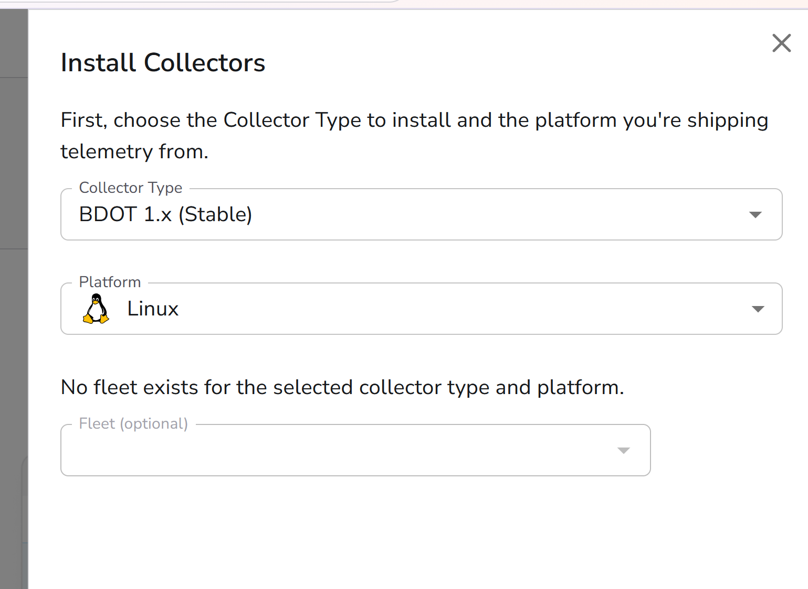

The **Bindplane Collector** is the component that runs on a host and collects telemetry. Its Bindplane's distribution of the OpenTelemetry Collector which is purpose-built for managed deployment. This means Bindplane can push configuration changes to it remotely via the OpAmp protocol, without you ever touching the host directly.

Once the collector is running and visible in the Bindplane UI, you're ready to tell it what to collect and where to send it.

### Watch: get the collector installation command

<video controls muted playsinline preload="metadata" style="width:100%; max-width:100%; height:auto;">
  <source src="../img/3-bindplane-agent/get_agent_installation_command.mp4" type="video/mp4">
  Your browser does not support embedded video.
  <a href="../img/3-bindplane-agent/get_agent_installation_command.mp4">Download the video</a> instead.
</video>

[hs-video](https://dt-arr.github.io/enablement-bindplane-logs/img/3-bindplane-agent/get_agent_installation_command.mp4|Get the agent installation command|Navigating Bindplane to generate the Linux agent install command.)

The written steps below follow the same flow.

### 1. Navigate to your Bindplane account
Under Collectors, Click the button "Install Collector"
<!--  -->

### 2. Specify your collector configuration
You can use the default, stable Collector Type.

- `Collector Type` select `BDOT 1.x (Stable)`
- `Platform` select `Linux`



You can leave "Fleet" blank.

And click `Next`
<!--  -->

### Install the collector
You'll be shown a command that installs the collector.  

- Copy it and run it in your terminal.

<!--  -->

You should see some text scroll by, and a message indicating that the Bindplane collector was installed.

<video controls muted playsinline preload="metadata" style="width:100%; max-width:100%; height:auto;">
  <source src="../img/3-bindplane-agent/terminal-installation.mp4" type="video/mp4">
  Your browser does not support embedded video.
  <a href="../img/3-bindplane-agent/terminal-installation.mp4">Download the video</a> instead.
</video>

[hs-video](https://dt-arr.github.io/enablement-bindplane-logs/img/3-bindplane-agent/terminal-installation.mp4|Install the Bindplane collector|Running the install command in the dev container terminal.)

<!--  -->

You may see some messages instructing you to use `systemctl` to start the Bindplane service.  DON'T DO THAT!  In this environment, you have a command called `startBindplane` instead.  Go ahead and run that in your terminal.

```
startBindplane
```

!!! warning "Bindplane Startup"
    Don't use the `systemctl` command to start Bindplane as the installation script mentions.  Instead, use the `startBindplane` command available in your terminal.

Once you've run that command, you should see your collector show up in the Bindplane UI.  It will be named after the host it is installed on.  If you are using a Codespace, it will be your Codespace name.  If you are using a local Dev Container, it will take the name of your Docker implementation.


<!--  -->

Go ahead and click "Create a Configuration" and we'll start ingesting some logs!

<div class="grid cards" markdown>
- [Create Configuration :octicons-arrow-right-24:](4-bindplane-configuration.md)
</div>
