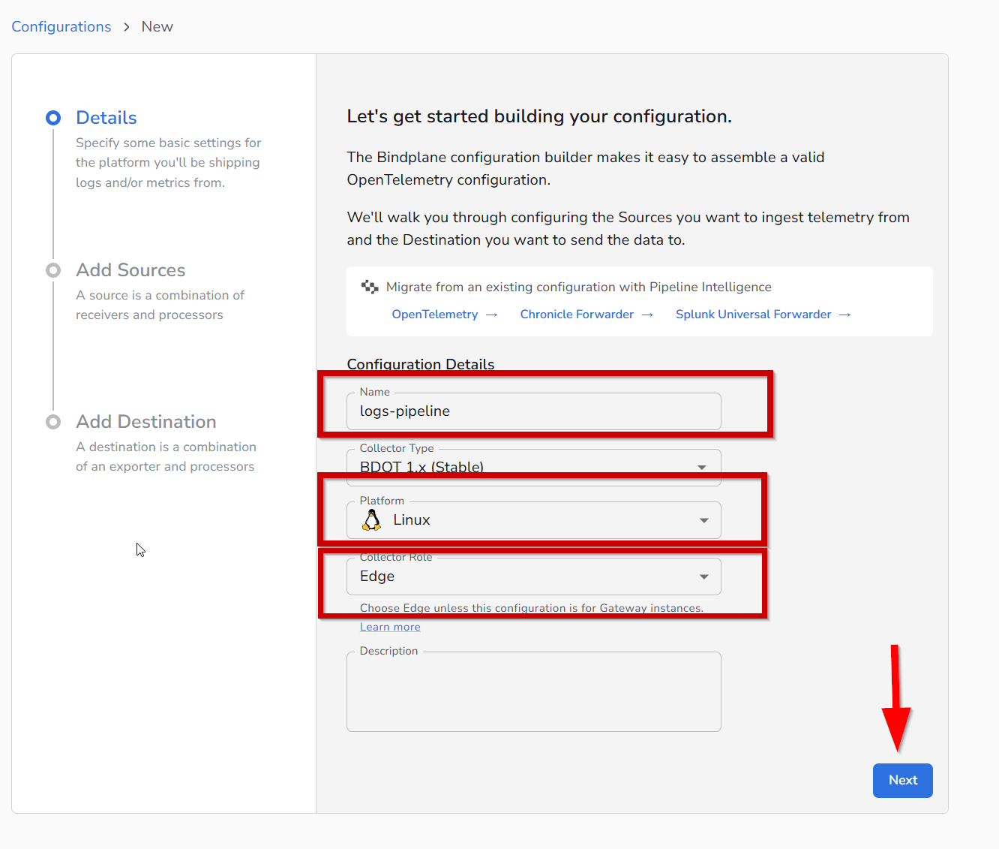
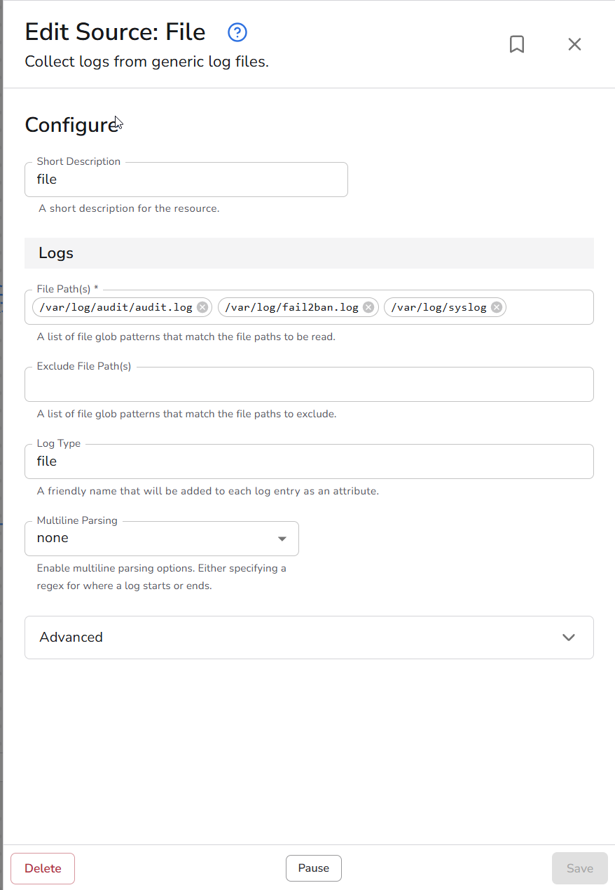
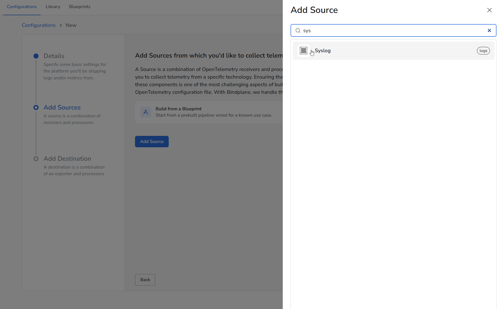
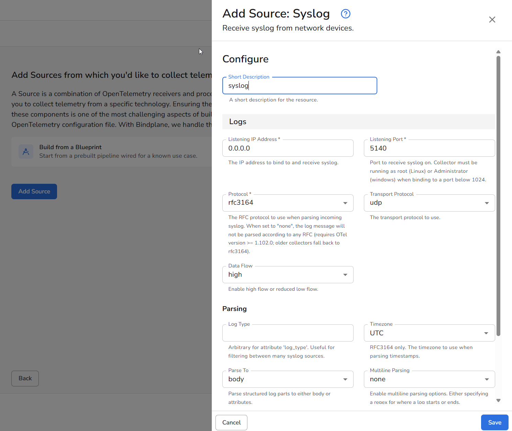
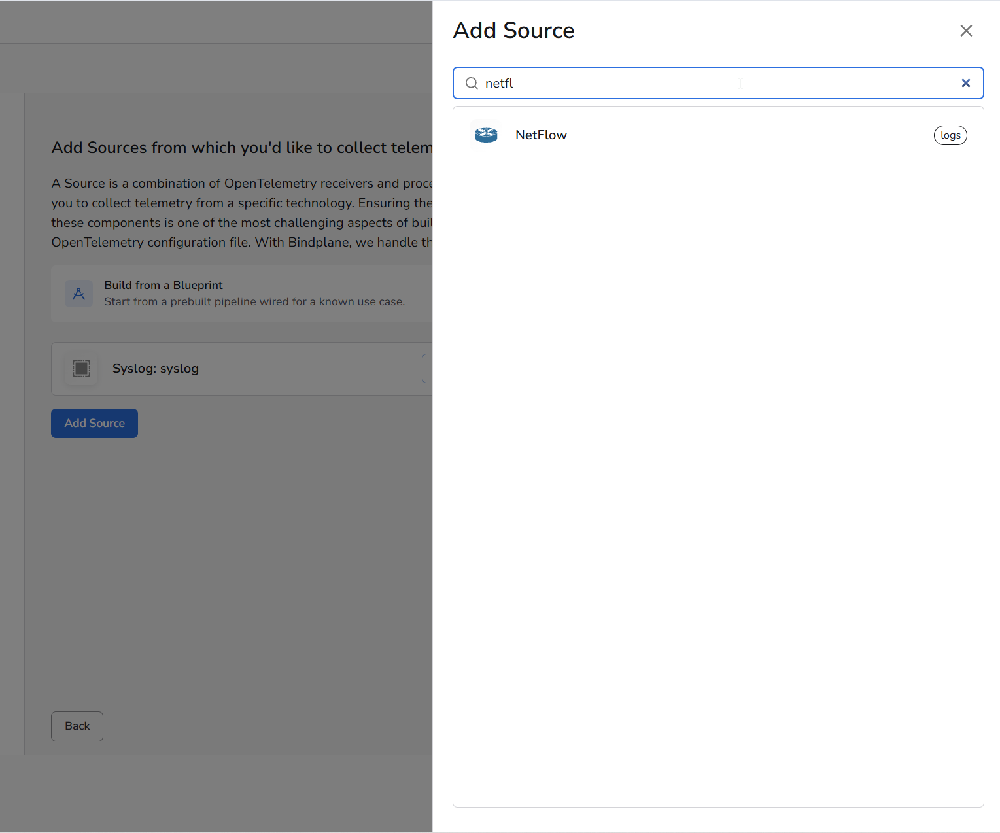
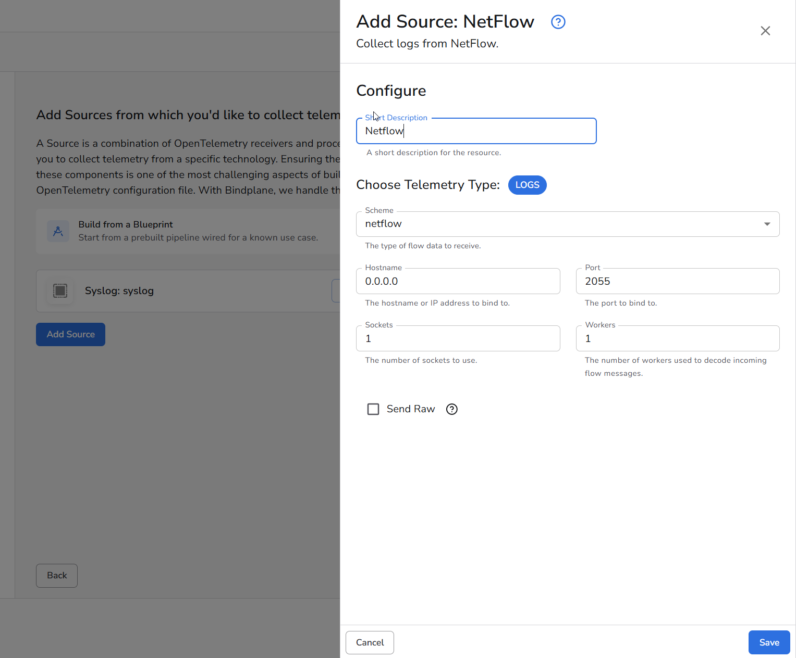
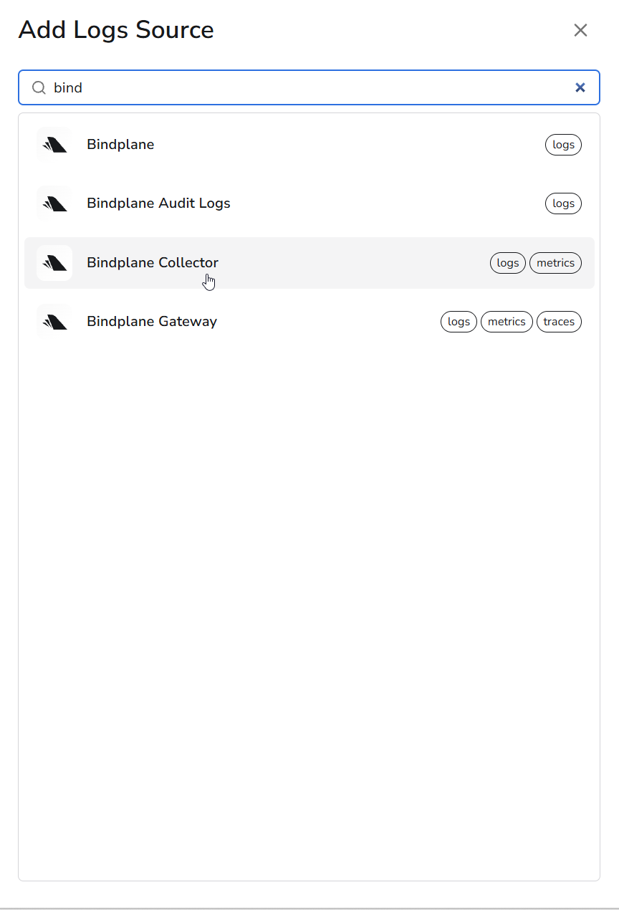
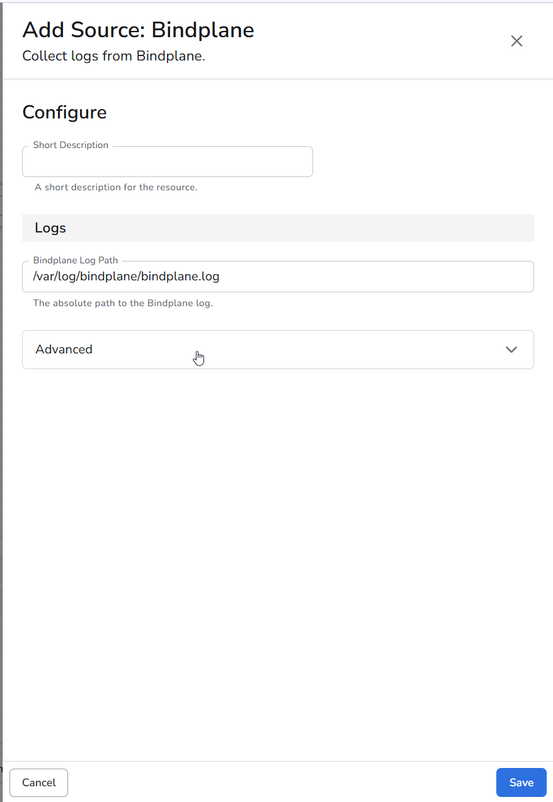
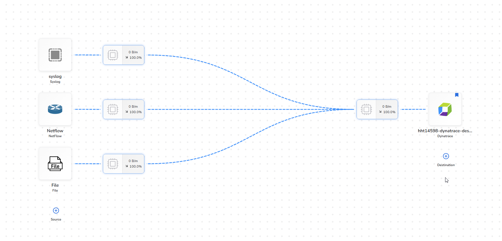
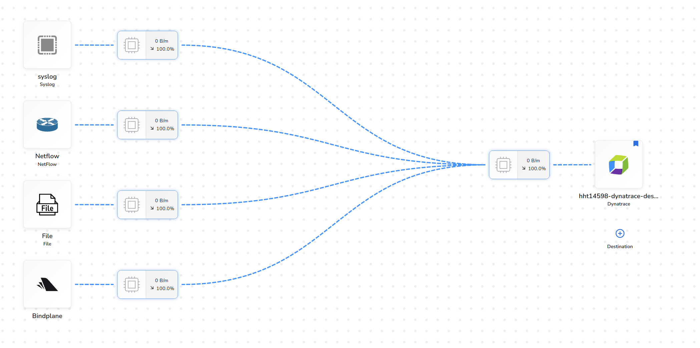

A Bindplane **Configuration** is a reusable, version-controlled definition of a telemetry pipeline. It describes three things: where data comes from (**Sources**), how it's transformed in-flight (**Processors**), and where it's sent (**Destinations**). Once a configuration is created, it can be deployed to one or many agents with a single rollout, and rolled back just as easily if something goes wrong.

In this section you build your first configuration: four sources and one destination.

| Source | Collects | Setting |
|---|---|---|
| **File** | Linux host logs | Three paths, listed in step 2 |
| **Syslog** | PAN-OS firewall records | UDP `5140`, RFC 3164 |
| **NetFlow** | Flow records | UDP `2055` |
| **Bindplane** | The collector's own logs | `/var/log/bindplane/bindplane.log` |

| Destination | Sends to |
|---|---|
| **Dynatrace** | Your environment over OTLP/HTTP, using your environment ID and token |

Once you assign your agent and roll it out, you will see throughput in the Bindplane pipeline overview and records arriving in the Dynatrace Logs app.

### 1. Create the configuration
Choose a descriptive name for your configuration, choose **Linux** for the platform, and click "next"


### 2. Add the File source

Click **Add Source**, search for `file`, and choose **File**.


Configure it with all three log files. These are the only three worth collecting: `auth.log`, `kern.log` and `cron.log` are duplicates of what is already in `syslog`, so adding them would double your volume for nothing.

| Setting | Value |
|---|---|
| Short Description | `file` |
| File Path(s) | `/var/log/syslog`<br>`/var/log/audit/audit.log`<br>`/var/log/fail2ban.log` |
| Log Type | `file` |
| Multiline Parsing | `none` |



### 3. Add the Syslog source

Click **Add Source**, search for `syslog`, and choose **Syslog**.



| Setting | Value |
|---|---|
| Short Description | `syslog` |
| Listening IP Address | `0.0.0.0` |
| Listening Port | `5140` |
| Protocol | `rfc3164` |
| Transport Protocol | `udp` |
| Data Flow | `high` |
| Timezone | `UTC` |
| Parse To | `body` |
| Multiline Parsing | `none` |



!!! warning "Two settings that matter later"
    **Protocol** must be `rfc3164`, not 5424. The generator sends BSD-format records, and 5424 will fail to parse them.

    **Parse To** must be `body`. It controls where the parsed syslog fields land, and the Parse CSV processor in a later section points at `body.message`. If you set this to `attributes`, that processor finds nothing and fails silently.

### 4. Add the NetFlow source

Click **Add Source**, search for `netflow`, and choose **NetFlow**.



| Setting | Value |
|---|---|
| Short Description | `Netflow` |
| Telemetry Type | `LOGS` |
| Scheme | `netflow` |
| Hostname | `0.0.0.0` |
| Port | `2055` |
| Sockets | `1` |
| Workers | `1` |
| Send Raw | unchecked |



!!! tip "NetFlow arrives as logs"
    The NetFlow receiver emits on the logs signal, so flow records show up in the Logs app rather than as metrics. NetFlow v5 needs no template exchange, so records decode immediately.

### 5. Add the Bindplane source

This one collects the collector's own logs, which you will use later for self-monitoring. Search for `bindplane` and choose **Bindplane**.



| Setting | Value |
|---|---|
| Bindplane Log Path | `/var/log/bindplane/bindplane.log` |



### 6. Create a Destination
We need to send our logs somewhere to make use of them.  Let's create a Destination that will send our logs to Dynatrace.

1. Click "Add Destination"
2. Seach for "Dynatrace"
3. Click on the Dynatrace Destination


### 7. Configure the Destination

Have a look at the documentation for Dyntrace's [OTel API](https://docs.dynatrace.com/docs/ingest-from/opentelemetry/otlp-api#base-url) to understand how to structure your endpoint URL.

1. Give this Destination a descriptive name
2. Enter your Dynatrace [Environment Id](https://docs.dynatrace.com/docs/shortlink/monitoring-environment#environment-id) 
3. Enter the token you created for that environment in the [Getting Started](../2-getting-started) section.


Alternatively, you can enter a custom [Dynatrace OTLP endpoint](https://docs.dynatrace.com/docs/ingest-from/opentelemetry/otlp-api#base-url) url by choosing "Custom" in the dropdown:


Click "Save" and you'll be sent to the Configuration you just created.

### 8. View the Configuration and Pipeline

We've created a Bindplane Configuration that can deployed wherever we need to collect and send logs.  You can see the logs pipeline we created, but it's not doing much right now because we haven't told any agents to use it.  Scroll down and you'll see a listing of all the agents using this configuration (none yet!), and a button to "Add Agents".


The configuration view lists every source you added, with the destination on the right.



The pipeline graph shows all four sources converging on the Dynatrace destination. Each source has its own processor slot, which is where you will add Parse CSV, Sampling and the rest in the sections that follow.



!!! tip "Throughput reads 0 B/m until an agent is attached"
    The percentages on each link are the share of data flowing down that path. They stay at zero until you complete the next step, so do not read anything into them yet.

### 9. Add the Agents to the Configuration

1. Click "Add Agents"
2. In the pop-up dialog, choose the Agent you created earlier
3. Click "Apply"


### 10. View the Data Flow

Now let's check to see that data is flowing in our pipeline

1. Click "Overview" in the top navigation bar.  You should be defaulted to the "Visualize" sub-tab.
2. See the visualization of your pipeline on the right.  You should see that your pipeline is shipping data to Dynatrace by viewing the MB/h.  Great job!

Once you're done, navigate back to your configuration.


### 11. View Logs in Dynatrace

Now let's verify that we're seeing the logs in Dynatrace.

1. Visit your Dynatrace environment and open the "Logs" app from the left-hand navigation (or search for it by using the search function in the top-left)
2. Click the "Run Query" button to fetch the latest logs from your environment.
3. View the results.  You might have a mix of logs from all places in this view since this is *everything* in your environment.  The syslogs for this lab can be identified by starting with a number enclosed in `<` and `>`, followed by a timestamp, followed by the hostname of your Dev Container (which should match the agent name we created earlier).

Example:
```
<6>1 2026-08-05T15:48:17.953Z lima-rancher-desktop ...
```

If you have so many logs streaming in that they may have been pushed out of the resultset, search for your Dev Container hostname using the filter bar at the top of the screen.


Now, let's put Bindplane and Dynatrace to work to make these logs more useful!

<div class="grid cards" markdown>
- [Add a field using a Bindplane processor:octicons-arrow-right-24:](5-add-field.md)
</div>
