A Bindplane **Configuration** is a reusable, version-controlled definition of a telemetry pipeline. It describes three things: where data comes from (**Sources**), how it's transformed in-flight (**Processors**), and where it's sent (**Destinations**). Once a configuration is created, it can be deployed to one or many agents with a single rollout, and rolled back just as easily if something goes wrong.

In this section you build your first configuration: four sources and one destination.

| Source | Collects | Setting |
|---|---|---|
| **File** | Linux host logs | Three paths, listed in step 2 |
| **Syslog** | PAN-OS firewall records | UDP `5140`, RFC 3164 |
| **NetFlow** | Flow records | UDP `2055` |
| **Bindplane Collector** | The collector's own logs and metrics | Defaults, no changes needed |

| Destination | Sends to |
|---|---|
| **Dynatrace** | Your environment over OTLP/HTTP, using your environment ID and token |

Once you assign your agent and roll it out, you will see throughput in the Bindplane pipeline overview and records arriving in the Dynatrace Logs app.

### 1. Create the configuration
Click **Configurations** then **Create Configuration**

- Choose a descriptive **name** for your configuration
- Select the collector Type to **`BDOT .x (Stable)`**
- Choose **Linux** for the `platform`
-  **Edge** for the Collector Role and click "next"
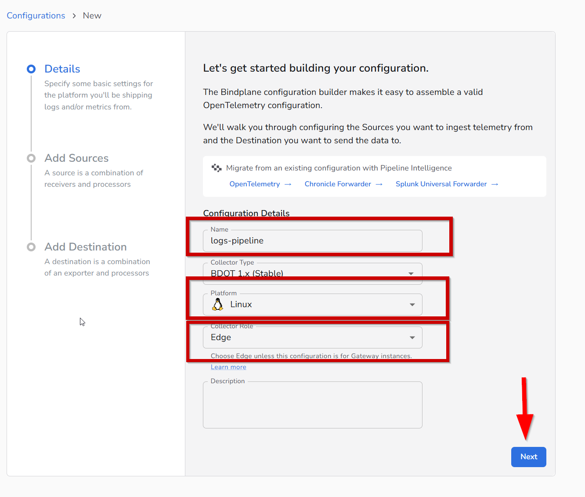

### Watch: adding all four sources

<video controls muted playsinline preload="metadata" style="width:100%; max-width:100%; height:auto;">
  <source src="../img/4-bindplane-configuration/add-sources-video.mp4" type="video/mp4">
  Your browser does not support embedded video.
  <a href="../img/4-bindplane-configuration/add-sources-video.mp4">Download the video</a> instead.
</video>

[hs-video](https://dt-arr.github.io/enablement-bindplane-logs/img/4-bindplane-configuration/add-sources-video.mp4|Add all four sources|Adding the File, Syslog, NetFlow and Bindplane Collector sources to the configuration.)

The same four sources are broken down step by step below.

### 2. Add the File source

Click **Add Source**, search for `file`, and choose **File**.

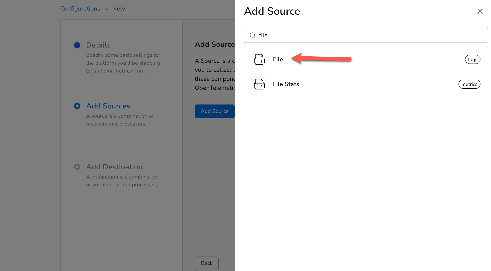

Configure it with all three log files. These are the only three worth collecting: `auth.log`, `kern.log` and `cron.log` are duplicates of what is already in `syslog`, so adding them would double your volume for nothing.

Configure as follows:

Tip: You may want to click outside after you paste the file paths

| Setting | Value |
|---|---|
| Short Description | `file` |
| File Path(s) | `/var/log/syslog` |
| File Path(s) | `/var/log/audit/audit.log` |
| File Path(s) | `/var/log/fail2ban.log` |

| Log Type | `file` |
| Multiline Parsing | `none` |

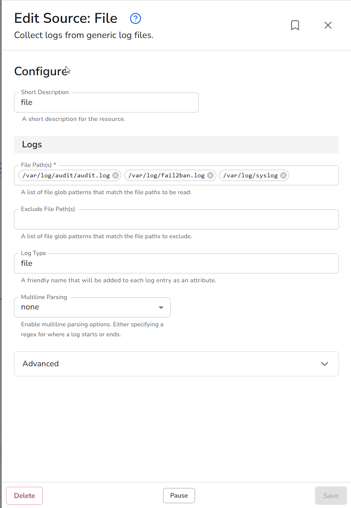

Click **Save**

### 3. Add the Syslog source

Click **Add Source**, search for `syslog`, and choose **Syslog**.

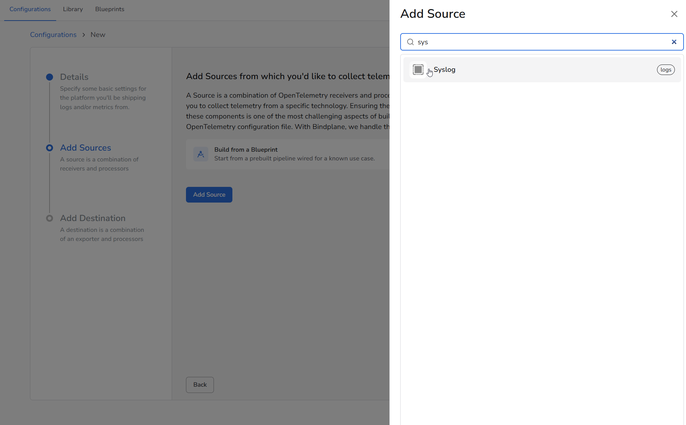

!!! tip "Accept defaults"
    Accept all defaults but just give a short description

| Setting | Value |
|---|---|
| Short Description | `syslog` | 

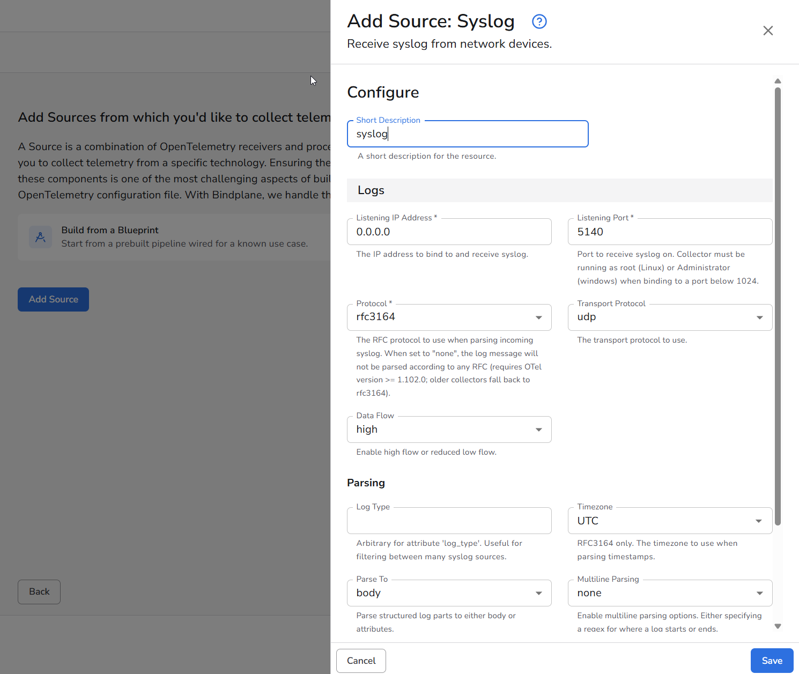

Click **Save**

### 4. Add the NetFlow source

Click **Add Source**, search for `netflow`, and choose **NetFlow**.

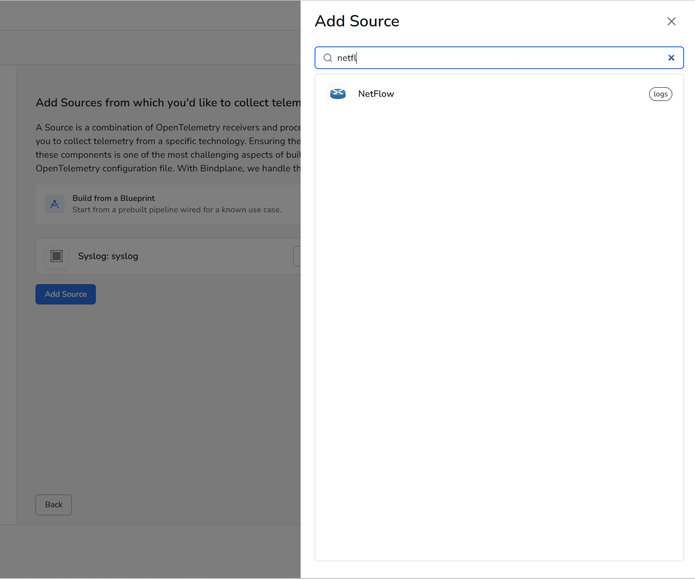

!!! tip "Accept defaults"
    Accept all defaults but just give a short description

| Setting | Value |
|---|---|
| Short Description | `Netflow` |


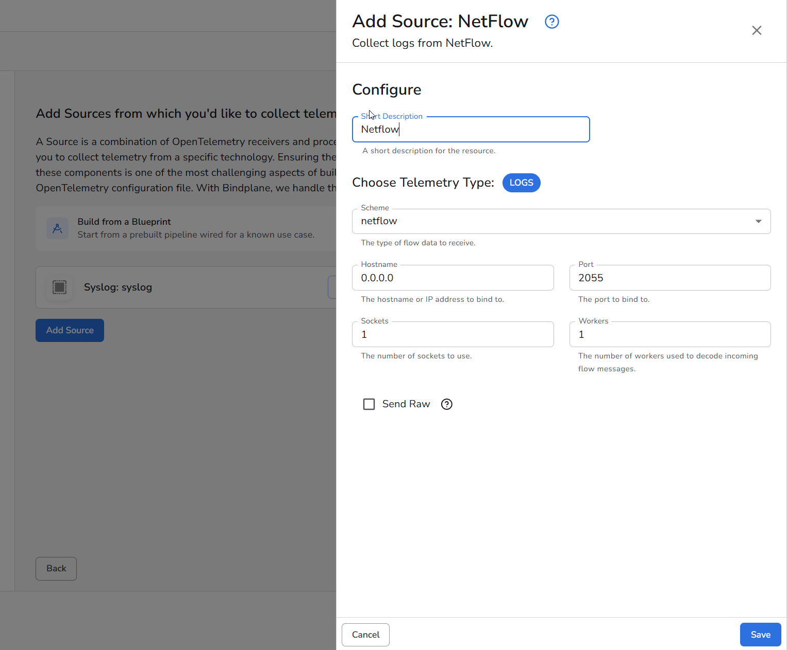

!!! tip "NetFlow arrives as logs"
    The NetFlow receiver emits on the logs signal, so flow records show up in the Logs app rather than as metrics. NetFlow v5 needs no template exchange, so records decode immediately.

Click **Save**

### 5. Add the Bindplane collector source

!!! tip "Accept defaults"
    Accept all defaults but just give a short description

This one collects the collector's own logs(and metrics), which you will use later for self-monitoring. Search for `bindplane` and choose **Bindplane Collector**.

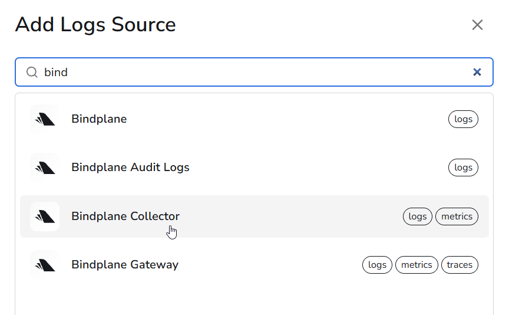

| Setting | Value |
|---|---|
| Short Description | `Bindplane self-telemetry` |

Don't change any other values.  Just accept the defaults.


Click **Save**

<!-- | Setting | Value |
|---|---|
| Bindplane Log Path | `/var/log/bindplane/bindplane.log` | -->

<!-- 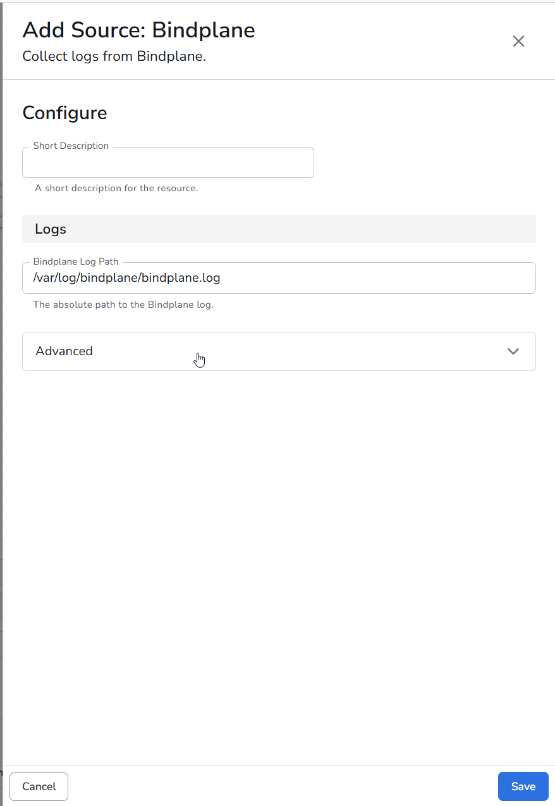 -->

With all four sources added, click **Next** to move on to the destination.


### 6. Create a Destination
We need to send our logs somewhere to make use of them.  Let's create a Destination that will send our logs to Dynatrace.

1. Click "Add Destination"
2. Seach for "Dynatrace"
3. Click on the Dynatrace Destination


### 7. Configure the Destination

Have a look at the documentation for Dyntrace's [OTel API](https://docs.dynatrace.com/docs/ingest-from/opentelemetry/otlp-api#base-url) to understand how to structure your endpoint URL.

1. Give this Destination a descriptive name
2. Enter your Dynatrace [Environment Id](https://docs.dynatrace.com/docs/shortlink/monitoring-environment#environment-id) 
- for lunchnlearn users, enter `lunchnlearn`
3. Enter the token you created for that environment in the [Getting Started](../2-getting-started) section. 
- for lunchnlearn users, follow these instructions:
- Run the following command to find the token:

```
grep '^DT_INGEST_TOKEN=' /workspaces/enablement-bindplane-logs/.devcontainer/.env | cut -d= -f2-
```

Note: If you have issues with the above, you can find the token and other details by opening the following file:

```
cat /workspaces/enablement-bindplane-logs/.devcontainer/.env
```


Advanced users: You can enter a custom [Dynatrace OTLP endpoint](https://docs.dynatrace.com/docs/ingest-from/opentelemetry/otlp-api#base-url) url by choosing "Custom" in the dropdown:


Click **Save** and then **Save** again, and you'll be sent to the Configuration you just created.

### 8. View the Configuration and Pipeline

The pipeline graph shows all four sources converging on the Dynatrace destination. Each source has its own processor slot, which is where you will add Parse CSV, Sampling and the rest in the sections that follow.

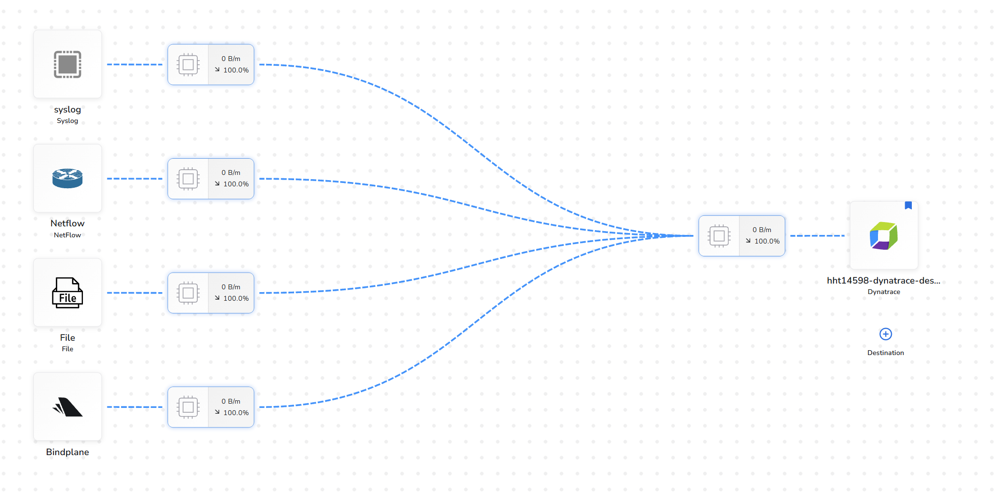

!!! tip "Throughput reads 0 B/m until an collectors is attached"
    The percentages on each link are the share of data flowing down that path. They stay at zero until you complete the next step, so do not read anything into them yet.

We've created a Bindplane Configuration that can deployed wherever we need to collect and send logs.  You can see the logs pipeline we created, but it's not doing much right now because we haven't told any collectors to use it.  Scroll down and you'll see a listing of all the collectors using this configuration (none yet!), and a button to "Add Collectors".

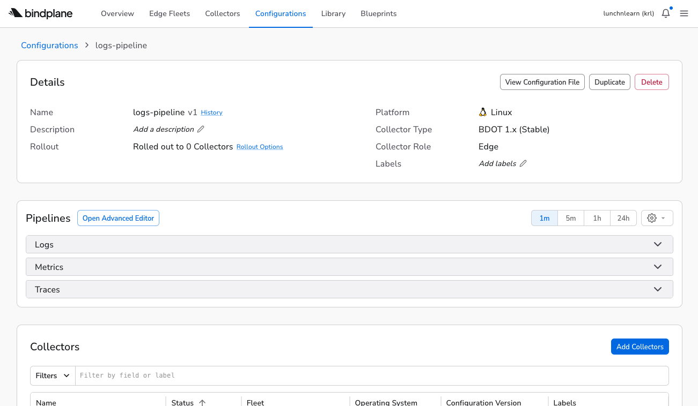


### 9. Add the Collectors to the Configuration

1. Click "Add Collectors"
2. In the pop-up dialog, choose the collector you created earlier
3. Click "Apply"

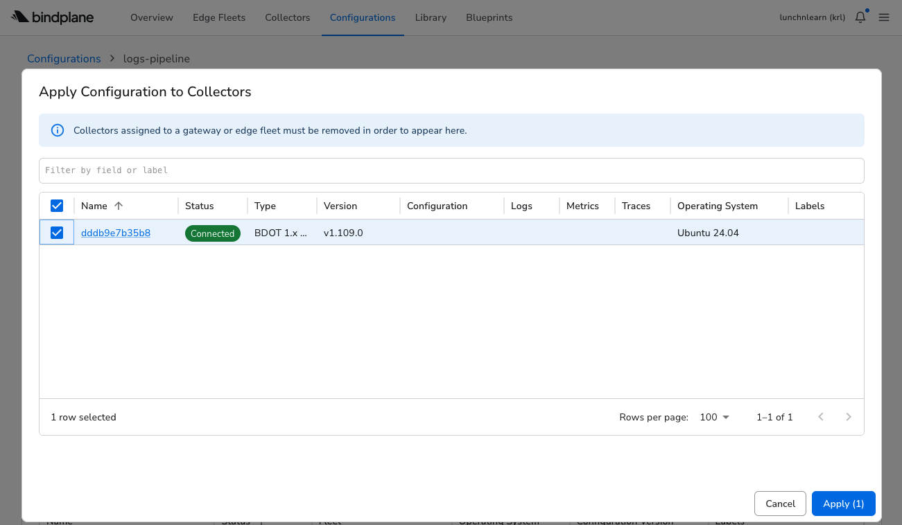

### 10. View the Data Flow

Now let's check to see that data is flowing in our pipeline

1. Click "Overview" in the top navigation bar.  You should be defaulted to the "Visualize" sub-tab.
2. See the visualization of your pipeline on the right.  You should see that your pipeline is shipping data to Dynatrace by viewing the MB/h. 

!!! danger "Check if telemetry is being dropped"
    If your telemetry is being dropped by the collector because of bad destination URL or bad token, you will find errors. To view the errors

To view the errors:
- Click on the `Bindplane Collector` processor `node` as seen in the screenshot
- If you see `errors` that means Telemetry is being dropped
- If you see `warn` and `info` only, that means Telemetry is being sent successfully.


