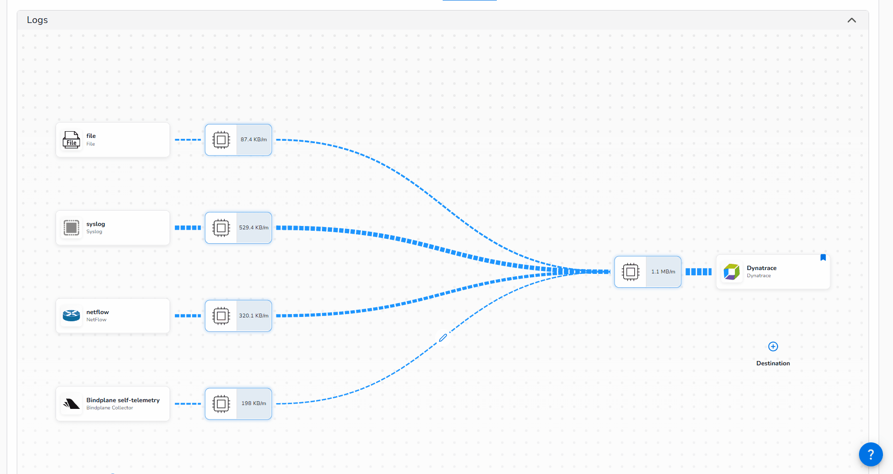
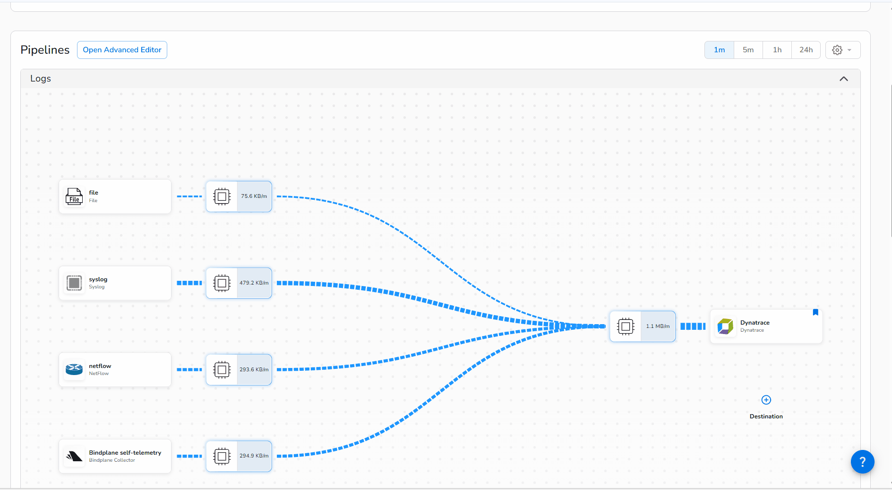
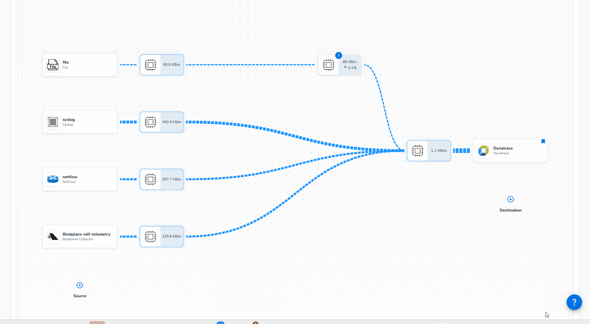
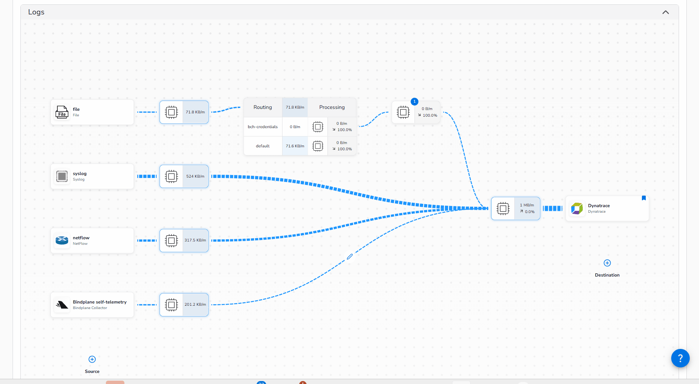

## Masking Data & Routing

During a meeting, you heard that a DevOps engineer runs a cloud-infrastructure script from a host on your network: your Dev Container. This may have exposed credentials.

`auditd` logs commands run on the system, including environment variables and command-line arguments. Let’s investigate.

!!! warning "Example Credentials"
    All lab logs and credentials are randomly and synthetically generated.

This is a common real-world risk. Automation scripts can expose credentials through system logs such as `auditd`.

The best fix is to stop sensitive data leaving your infrastructure. Bindplane’s **Redact Sensitive Data** processor can match sensitive values with regex and replace them using **hashing**. Unlike blank redaction, hashing preserves uniqueness, so you can identify repeated credentials and assess exposure without revealing the original value.

Let’s check the logs for any **Big Cloud Hyperscaler (BCH)** credentials.

### 1. Search unmasked log data

- Click on the `File log` source
- Type `BCH` on the top search botton
- Wait for search to complete and look for the log message that contains BCH and the access and secret keys



Let's use Bindplane to mask the sensitive data.  Navigate to your Bindplane Configuration so we can make these changes.

### 2. Create a New Processor Node
*Spoiler alert: We're looking a bit into the future here.  Normally you could just add the masking processor to one of your existing Processor Nodes.  But for the purposes of the Lab, we're going to pre-optimize for what we know is coming and create an additional one.*

- Click on the pencil icon in the connection between your existing Processor Nodes, and select "Insert Processor Node"



- Then click "Start Rollout" so we can actually send our logs through it.


### 3. Mask Sensitive Data

After the rollout is complete, click on the new node so we can add the processor.

1. Search for `BCH` in the search bar so we can narrow our focus to the offending logs
2. Search for the `Redact Sensitive Data` processor in the list
3. Select it when it surfaces


!!! tip "Credential Regex"
    - The BCH access key takes the form of the string "BCHK" followed by 16 alpha numeric upper case characters.  The regex for that is:  `BCHK[A-Z0-9]{16}`
    - The secret access key is simply a 40 character mixed-case string.  `[A-Za-z0-9/+]{40}`

1. Create a descriptive name for this processor
2. Change the Redaction Strategy to `Hashing`
3. Uncheck `Redaction Rule Presets`.  Although this is very useful and convenient, we'll just focus on our immediate issue for now
4. Create two `Custom Redaction Rules` for the two credentials(`BCHK[A-Z0-9]{16}` and `[A-Za-z0-9/+]{40}`) we want to redact.  Enter the regular expressions that match them
5. Click `Save` at the bottom of that dialog so we can preview our changes


Access key:

```
BCHK[A-Z0-9]{16}
```

Secret access key:

```
[A-Za-z0-9/+]{40}
```

Success!!!  Our sensitive credentials have been replaced with hashed strings, and the rest of our log message remains intact, so we can still work with them in full detail.


Click "Save" at the bottom to save changes to the processor and return to our pipeline config.

### 4. Routing Data Selectively

Wait a second.  We are sending *all* logs through our processor.  Is it possible that our regex could match some other data that has a similar format, but *isn't* a credential?

**Don't roll out the changes just yet!**

We can narrow down our redaction to specific logs using [Routing](https://docs.bindplane.com/integrations/connectors/routing).  

- Begin by clicking the pencil icon between the first Processing Node coming out of the Syslog source and the new one we just created.

- Choose "Insert Connector", and then choose "Routing"



1. Give a name to **route ID**. E.g. `bch-credentials`. [This step  Identifies the first route indicating that it is for logs containing the credentials. But we need to define the condition]
2. Click `Add condition` 
3. Choose to **match** the `Log`, click inside **field** and select the `body` field, and then choose `Matches`
3. Enter the regular expression `BCH_ACCESS_KEY_ID=|BCH_SECRET_ACCESS_KEY=`
4. Scroll down, name the second route to "default" and don't create any conditions
5. Click "Save"

See sample screenshot:


### 5. Connect the Routes

- Connect the **default** route to processor close to the destination as shown in the below animation.
- Click "Start Rollout" to apply changes.




### 6. Verify in Dynatrace

Head back over to Dynatrace and have a look at one of the most recent logs.

Success!  Now we see hashed values instead of our sensitive credentials!


Let's assess the impact of this leak.

<div class="grid cards" markdown>
- [Extracting Metrics from Logs:octicons-arrow-right-24:](8-metric-extraction.md)
</div>
