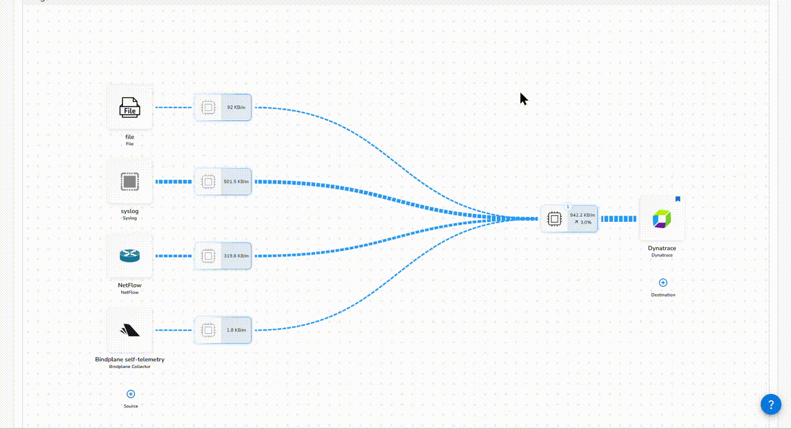
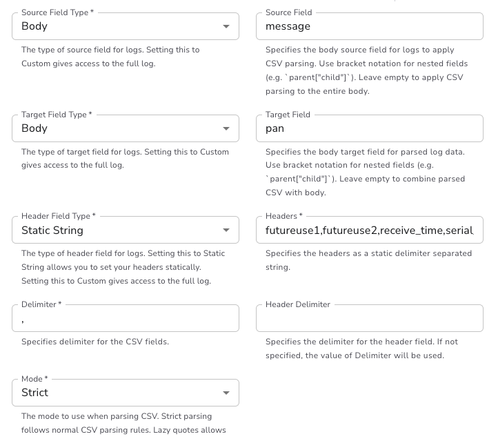

# Structured Field Extraction

## The problem

A PAN-OS TRAFFIC record arrives as one long comma separated string. Dynatrace stores it in the `content` field and has no idea that position 31 is the firewall action or that position 33 is the byte count. Everything in that record is technically present and practically unreachable.

Every question you ask has to split the string first, index the right position, and cast the result. The analyst has to know the field offsets by heart, the queries are unreadable, and nothing can be used as a dimension in a dashboard or an alert without repeating the same parsing expression.

Bindplane has a **Parse CSV** processor that does this. You give it the delimiter and a list of column names, and it turns the CSV into named fields. 

## Configure it in Bindplane

### Watch: parsing the PAN-OS CSV




Add a processor to your Syslog source
- Click on `Edit processors` close to the `syslog` source
- Click on ` Add processor`
- Search for **Parse CSV**. Telemetry type is **LOGS**.
- Enter a Short description `Parse CSV`
- Add these two conditions
| Match | Field | Operator | String |
|---|---|---|---|
| Body | `appname` | Equals | `PAN-OS` |
| Body | `message` | Contains | `,TRAFFIC,end,` |

!!! danger "The second condition is CONTAINS and not EQUAL"
    Make sure you select CONTAINS for the condition that matches the text `,TRAFFIC,end,`


    

- Set the remaining fields as follows:


| Setting | Value |
|---|---|
| Source Field Type | **Body** |
| Source Field | `message` |
| Target Field Type | **Body** |
| Target Field | `pan` |
| Header Field Type | **Static String** |
| Headers | the 38 names below |
| Delimiter | `,` |
| Header Delimiter | leave empty |
| Mode | **Strict** |


Under headers, paste the following:

```
futureuse1,futureuse2,receive_time,serial_number,type,subtype,futureuse3,generate_time,src_ip,dst_ip,nat_src_ip,nat_dst_ip,rule_name,src_user,dst_user,app,vsys,src_zone,dst_zone,inbound_if,outbound_if,log_action,futureuse4,session_id,repeat_cnt,src_port,dst_port,nat_src_port,nat_dst_port,flags,protocol,action,bytes,bytes_sent,bytes_received,packets,elapsed,session_end_reason
```

    

!!! danger "Source Field is Body, not Attributes"
    The Bindplane Syslog source runs a `move` operator that relocates `appname`, `message`, `hostname`, `facility` and `priority` from attributes into the body. Point Parse CSV at attributes and it will find nothing, silently.


!!! tip "Don't forget to rollout the change"
    The Bindplane Syslog source runs a `move` operator that relocates `appname`, `message`, `hostname`, `facility` and `priority` from attributes into the body. Point Parse CSV at attributes and it will find nothing, silently.

## The fields you get

Verified against live records. The ones that matter for the later exercises:

| Field | Example |
|---|---|
| `pan.src_ip` / `pan.dst_ip` | `10.13.49.71` / `40.237.115.207` |
| `pan.src_port` / `pan.dst_port` | `32893` / `53` |
| `pan.rule_name` | `DC-Replication` |
| `pan.src_user` | `contoso.local\hnakamura` |
| `pan.app` | `dns` |
| `pan.src_zone` / `pan.dst_zone` | `trust` / `mgmt` |
| `pan.protocol` | `tcp` |
| `pan.action` | `allow` |
| `pan.bytes_sent` / `pan.bytes_received` | `484765` / `59289` |
| `pan.packets` | `1476` |
| `pan.elapsed` | session duration in seconds |
| `pan.session_end_reason` | `aged-out` |

The `futureuse` columns are real PAN-OS padding fields. They are named so the positions line up, and you can ignore them.


Or count what actually reached Dynatrace, which also catches a record that changed in flight:

```
fetch logs
| filter matchesPhrase(content, "TRAFFIC,end")
| fieldsAdd field_count = arraySize(splitString(content, ","))
| summarize count(), by: {field_count}
```


## Before and after at query time

Finding large transfers on a denied session.

**Before:**

```
fetch logs
| filter project == "TonyStark" // DONT FORGET TO CHANGE THE VALUE from TonyStark TO YOUR NAME
| filter appname == "PAN-OS"
| filter matchesPhrase(content, "TRAFFIC,end")
| fieldsAdd action = splitString(content, ",")[31] // THIS SPLITS THE CONTENT BY THE COMMA ',' DELIMITER AND FETCHES THE 31ST FIELD
```

**After:**

```
fetch logs
| filter project == "TonyStark" // DONT FORGET TO CHANGE THE VALUE from TonyStark TO YOUR NAME
| filter appname == "PAN-OS"
| filter matchesPhrase(content, "TRAFFIC,end") 
| sort  timestamp desc
| fieldsKeep timestamp, "pan.*" // LETS LOOK AT ALL THE EXTRACTED FIELDS THAT STARTS WITH PAN
```
