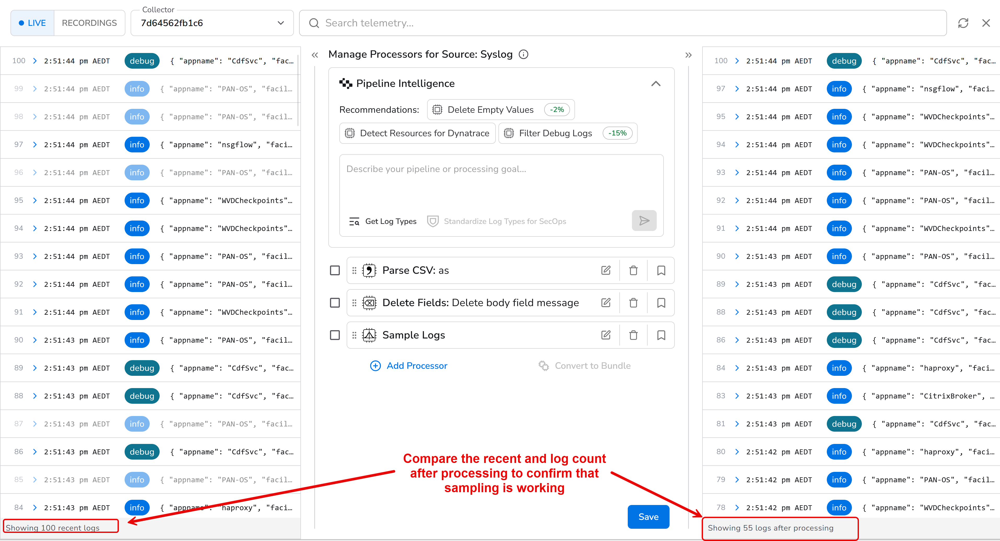

# Volume Reduction

## The problem

Firewall traffic logs are typically one of the highest-volume sources in an environment, and most individual records are of low value. PAN-OS writes a TRAFFIC record for every completed session, and the majority of those sessions were permitted and ended normally. In the mock environment used in this lab, about 92 percent of TRAFFIC records have `action=allow` with a routine session end reason such as `tcp-fin` or `aged-out`.

The remaining 8 percent are the records most likely to be needed in an investigation. A `deny`, `drop`, or `reset-both` session indicates that a security policy was enforced, so these records should be forwarded complete and unsampled.

There is also a second source of unnecessary volume, introduced by the parsing step. After Parse CSV runs, each record contains both the original CSV string in `body.message` and the same values as named fields. Sending both means every record carries its data twice.

This section addresses both issues in order:

1. **Remove the raw message.** Once the fields have been parsed, the original string in `body.message` is redundant and can be dropped.
2. **Sample routine traffic.** Forward all denied, dropped, and reset sessions at full fidelity, and sample permitted sessions at a ratio you choose.

Reducing volume in the pipeline, before data reaches any destination, lowers costs across the board: less network bandwidth between sites and the cloud, less storage consumed, and less data scanned at query time. The effect is most pronounced for destinations priced on daily ingest volume, such as many traditional SIEM platforms, where high-volume firewall logs are often a major driver of licensing cost. Because sampling is applied only to routine permitted traffic, the records needed for security analysis are unaffected.

## Volume reduction

### Volume reduction by removing the raw message

##### Add another processor to your Syslog source

- Click on `Edit processors` close to the `syslog` source (it should read as 1 to indicate it already has one processor)
- Click on ` Add processor`
- Search and click **Delete Fields**. Telemetry type is **LOGS**.
- Enter a Short description `Delete body.message`
- Add these two conditions (this is same as what we defined before)

| Match | Field | Operator | String |
|---|---|---|---|
| Body | `appname` | Equals | `PAN-OS` |
| Body | `message` | Contains | `,TRAFFIC,end,` |

!!! danger "The second condition is CONTAINS and not EQUAL"
    Make sure you select CONTAINS for the condition that matches the text `,TRAFFIC,end,`

Screenshot of the conditions:

    

- Click inside `Body Fields` and select `message` [This means if the above conditions are met, the `body` field `message` will be dropped]

Screenshot showing that the `message` are deleted:

## Sampling ALLOW logs

- Add another processor to the existing 2 processors
- Search for **Sample Logs** and select it
- Give a short description like **Sample ALLOW logs**
- Click on **Add Condition**
- Select ``Body`` for Match
- Click inside Field and select `pan["action"]`
- Condition to `Equals` (default)
- Click inside String and select `allow`
- Select Drop Ratio to `0.9`

| Drop Ratio | How much logs are sent out|
|---|---|
| `0.9` | 10 percent |
| `0.8` | 20 percent |
| `0.5` | 50 percent |
 

Validate within Bindplane before saving to view the volume reduction

