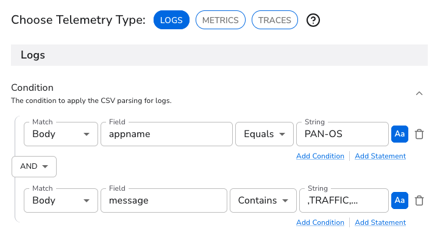
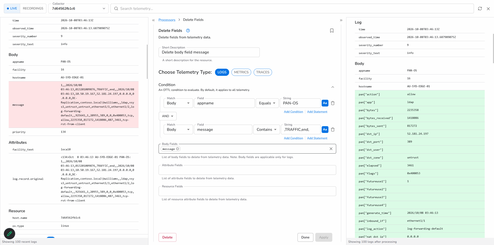

# Volume Reduction

## The problem

Firewall traffic logs are typically one of the highest-volume sources in an environment, and most individual records are of low value. PAN-OS writes a TRAFFIC record for every completed session, and the majority of those sessions were permitted and ended normally. In the mock environment used in this lab, about 92 percent of TRAFFIC records have `action=allow` with a routine session end reason such as `tcp-fin` or `aged-out`.

The remaining 8 percent are the records most likely to be needed in an investigation. A `deny`, `drop`, or `reset-both` session indicates that a security policy was enforced, so these records should be forwarded complete and unsampled.

There is also a second source of unnecessary volume, introduced by the parsing step. After Parse CSV runs, each record contains both the original CSV string in `body.message` and the same values as named fields. Sending both means every record carries its data twice.

This section addresses both issues in order:

1. **Remove the raw message.** Once the fields have been parsed, the original string in `body.message` is redundant and can be dropped.
2. **Sample routine traffic.** Forward all denied, dropped, and reset sessions at full fidelity, and sample permitted sessions at a ratio you choose.

Reducing volume in the pipeline, before data reaches any destination, lowers costs across the board: less network bandwidth between sites and the cloud, less storage consumed, and less data scanned at query time. The effect is most pronounced for destinations priced on daily ingest volume, such as many traditional SIEM platforms, where high-volume firewall logs are often a major driver of licensing cost. Because sampling is applied only to routine permitted traffic, the records needed for security analysis are unaffected.

## Volume reduction

### Volume reduction by removing the raw message

##### Add another processor to your Syslog source

- Click on `Edit processors` close to the `syslog` source (it should read as 1 to indicate it already has one processor)
- Click on ` Add processor`
- Search and click **Delete Fields**. Telemetry type is **LOGS**.
- Enter a Short description `Delete body.message`
- Add these two conditions (this is same as what we defined before)

| Match | Field | Operator | String |
|---|---|---|---|
| Body | `appname` | Equals | `PAN-OS` |
| Body | `message` | Contains | `,TRAFFIC,end,` |

!!! danger "The second condition is CONTAINS and not EQUAL"
    Make sure you select CONTAINS for the condition that matches the text `,TRAFFIC,end,`

Screenshot of the conditions:

    

- Click inside `Body Fields` and select `message` [This means if the above conditions are met, the `body` field `message` will be dropped]

Screenshot showing that the `message` are deleted:



## Sampling ALLOW logs

- Add another processor to the existing 2 processors
- Search for **Sampling**. 

**Condition**

```
body["pan"]["action"] == "allow"
```

**Drop Ratio**: `0.9`


The **Field** is chosen from the dropdown rather than typed. Picking `pan["action"]` there is what produces the OTTL condition above.

That is the whole configuration. The processor drops 90 percent of the records that match the condition and passes everything else through untouched. Because the condition names `allow` explicitly, a `deny`, `drop` or `reset-both` record can never be selected for dropping.

| Drop Ratio | Keeps of allow traffic |
|---|---|
| `0.9` | 10 percent |
| `0.8` | 20 percent |
| `0.5` | 50 percent |

### The generated config

```yaml
sampling/panos_allow:
  drop_ratio: 0.9
  condition: body["pan"]["action"] == "allow"
```

## Measured result

Tested against live generator output with the processor in place.

| | Records | Raw bytes |
|---|---|---|
| Before | 561 | 171,327 |
| After | 94 | 27,950 |
| **Reduction** | **84%** | **84%** |

| Action | Before | After | Kept |
|---|---|---|---|
| `allow` | 517 | 50 | 9% |
| `deny` | 22 | 22 | **100%** |
| `drop` | 11 | 11 | **100%** |
| `reset-both` | 11 | 11 | **100%** |

Every denied session survived. Allow traffic came down to roughly a tenth.

!!! note "84 percent of what"
    That figure is the reduction on the **PAN-OS records only**. Your overall saving depends on what share of total volume the firewall represents. In this lab it sits alongside file logs, NetFlow and collector self-monitoring, so the whole-pipeline figure is lower, which is why the lab objectives quote a more conservative number. When you size this for a customer, apply the ratio to their firewall volume rather than their total.

## Why firewall logs for this

It is fair to ask whether this dataset makes the exercise harder than it needs to be. For volume reduction it is the opposite. Firewall traffic is the textbook case:

- **The volume is genuinely there.** Firewall session logs are usually the largest single log source in an enterprise, so the saving is material rather than academic.
- **The keep-or-drop signal is one field.** You are not writing heuristics about what looks interesting, you are reading the action the firewall already decided on. That makes the rule easy to explain and easy to defend.
- **The 92 to 8 split is realistic.** Customers recognise their own environment in it, which is what makes the cost conversation land.

The awkward part of this dataset was never the reduction, it was the positional CSV. The Parse CSV processor handles that from the UI, so the difficulty disappears.

## Lab exercise

**Goal:** cut PAN-OS log volume by more than 80 percent without losing a single denied session.

1. Confirm the generator is running.

    ```bash
    ps -eo args | grep "[p]ush_telemetry"
    ```

2. Record your baseline. In the Bindplane configuration overview, note the throughput in MB per hour on the Syslog source. Screenshot it.

3. Count records by action so you know the starting mix.

    ```
    fetch logs
    | filter isNotNull(pan.action)
    | summarize count(), by: {pan.action}
    ```

4. Add a **Sampling** processor after Parse CSV. Set the condition and a drop ratio of `0.9`.

5. Roll out the configuration.

6. Wait five minutes and compare throughput against your screenshot. It should have fallen by roughly 80 percent.

7. Prove nothing was lost. Re-run the query from step 3. The `deny`, `drop` and `reset-both` counts should keep climbing at the same rate. Only `allow` should have slowed.

8. Change the drop ratio to `0.5`, roll out, and watch throughput settle at about half the original instead of a tenth.

**Checkpoint:** you can state the reduction percentage and show that denied sessions still arrive at full rate.

!!! warning "Sample the routine traffic only"
    It is tempting to sample everything, because the headline number gets bigger. Do not. The value of this pattern is that it is defensible to a security team: you can point at the condition and show that policy-relevant records bypass it entirely. A blanket sampler gives that up for a few more percent.

!!! tip "Talking about cost"
    Relate the reduction to both ingest and retention. A record that is never ingested is also never retained, so the saving compounds over the retention period. Use the customer's own retention setting when you size it, and use their own action mix rather than the 92 to 8 from this lab.
